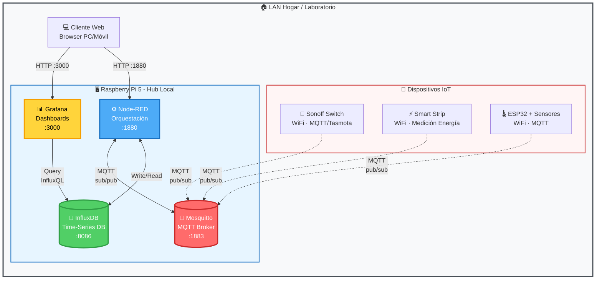
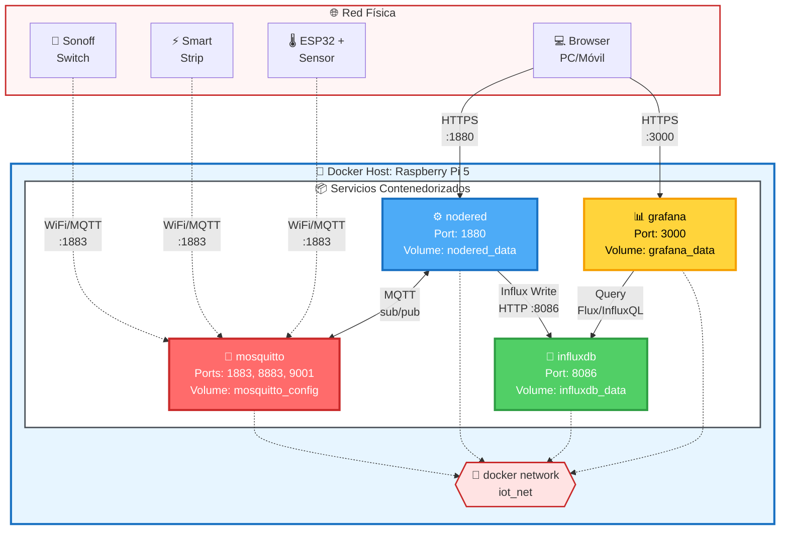
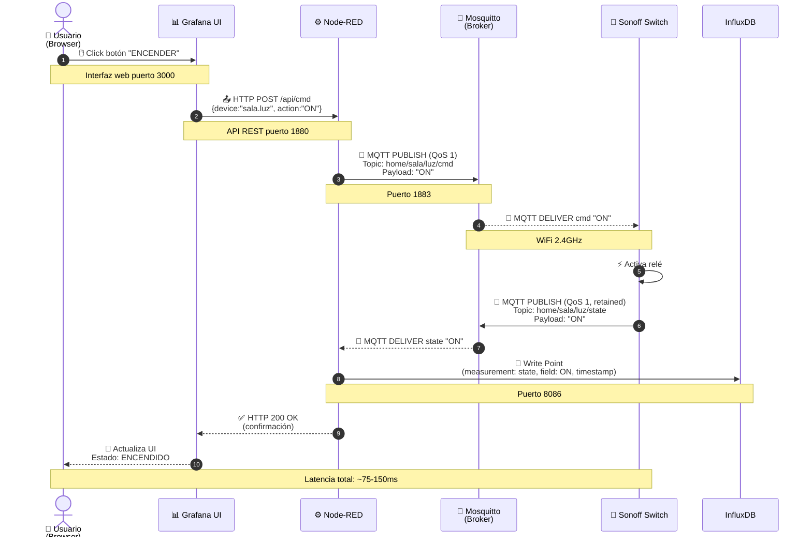
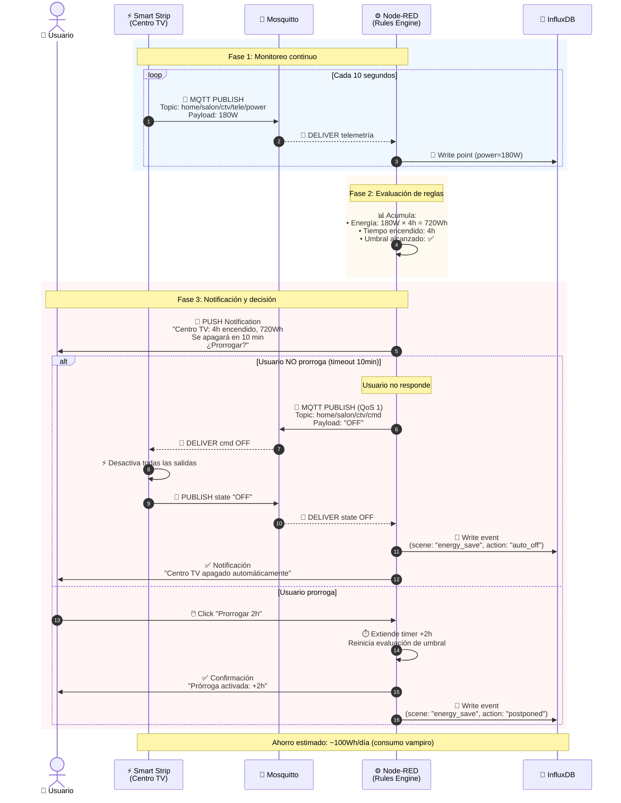
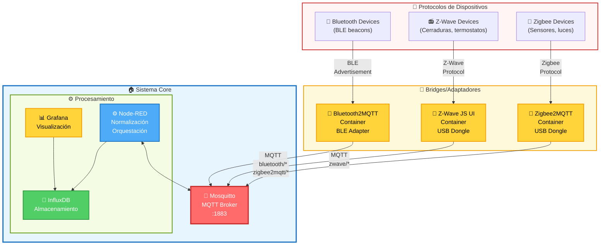

# 🏠 Prototipo IoT Domótico Autónomo - Arquitectura de Software

[](https://opensource.org/licenses/MIT)
[](https://www.raspberrypi.com/)
[](https://mqtt.org/)
[](https://www.docker.com/)

> Sistema domótico autónomo sobre red IoT montado en microordenador de bajo costo y tecnologías open-source para gestionar y optimizar dispositivos inteligentes en entorno doméstico.

---

## 📋 Tabla de Contenidos

- [Descripción del Proyecto](#-descripción-del-proyecto)
- [Arquitectura del Sistema](#-arquitectura-del-sistema)
- [Componentes Principales](#-componentes-principales)
- [Objetivos de Calidad](#-objetivos-de-calidad)
- [Diagramas de Arquitectura](#-diagramas-de-arquitectura)
- [Instalación](#-instalación)
- [Documentación Completa](#-documentación-completa)

---

## 🎯 Descripción del Proyecto

Este trabajo presenta el desarrollo de un **sistema domótico autónomo** sobre una red IoT montado en un microordenador de bajo costo y tecnologías open-source, con el fin de **gestionar y optimizar dispositivos inteligentes** en un entorno doméstico.

### ✨ Características Principales

- 🔒 **Autonomía total**: Funcionamiento 100% local sin dependencia de servicios en la nube
- 💰 **Bajo costo**: Basado en Raspberry Pi 5 (~$80-100 USD) y dispositivos WiFi económicos
- 🌐 **Open-source**: Stack completo basado en software libre
- ⚡ **Eficiencia energética**: Monitoreo de consumo y escenas automatizadas de ahorro
- 📊 **Observabilidad**: Dashboard en tiempo real + historial de métricas
- 🔌 **Extensible**: Soporte para múltiples protocolos (WiFi, Zigbee, Z-Wave)

---

## 🏗️ Arquitectura del Sistema

### Stack Tecnológico

| Capa | Tecnología | Función |
|------|-----------|---------|
| **Hub Local** | Raspberry Pi 5 | Microordenador de bajo costo (4GB/8GB RAM) |
| **Mensajería** | Mosquitto (MQTT) | Broker de mensajes pub/sub |
| **Orquestación** | Node-RED | Automatización de flujos y escenas |
| **Almacenamiento** | InfluxDB | Base de datos de series de tiempo |
| **Visualización** | Grafana | Dashboards y control en tiempo real |
| **Dispositivos** | Sonoff, ESP32, Smart Strip | Interruptores WiFi, sensores, medición energía |

### Vista de Contexto (Alto Nivel)



---

## 🧩 Componentes Principales

### Raspberry Pi 5 (Hub Local)
- **CPU**: 4 núcleos @ 2.4GHz
- **RAM**: 4GB / 8GB
- **Conectividad**: Gigabit Ethernet + WiFi 6
- **Función**: Host Docker para todos los servicios

### Mosquitto (MQTT Broker)
- **Puerto**: 1883 (TCP), 8883 (TLS), 9001 (WebSocket)
- **Función**: Mensajería pub/sub entre dispositivos
- **Seguridad**: Autenticación usuario/contraseña + ACL

### Node-RED (Orquestación)
- **Puerto**: 1880
- **Función**: Automatización de flujos, escenas, reglas
- **Features**: 
  - Ingesta de telemetría MQTT → InfluxDB
  - Control de dispositivos (on/off, ajustes)
  - Escenas automatizadas (ahorro energético)
  - API REST para interfaces externas

### InfluxDB (Time-Series DB)
- **Puerto**: 8086
- **Función**: Almacenamiento de métricas y telemetría
- **Retención**: 7 días datos crudos + downsampling para históricos
- **Measurements**: power, energy, state, temperature, humidity

### Grafana (Visualización)
- **Puerto**: 3000
- **Función**: Dashboard interactivo + control de dispositivos
- **Features**:
  - Gráficos en tiempo real
  - Historial de consumo energético
  - Alertas configurables
  - Botones de control (on/off)

### Dispositivos IoT

#### Sonoff Switch (Tasmota)
- **Protocolo**: WiFi 2.4GHz + MQTT
- **Función**: Control de iluminación y cargas resistivas
- **Firmware**: Tasmota (open-source)

#### Smart Strip con Medición
- **Protocolo**: WiFi 2.4GHz + MQTT
- **Función**: Control independiente de tomas + medición energía
- **Métricas**: Potencia (W), voltaje (V), corriente (A), energía acumulada (Wh)

#### ESP32 + Sensores
- **Protocolo**: WiFi 2.4GHz + MQTT
- **Sensores**: DHT22 (temperatura + humedad), expansible
- **Firmware**: Custom (Arduino/PlatformIO)

---

## 🎯 Objetivos de Calidad

| Atributo | Meta | Implementación |
|----------|------|----------------|
| **Baja Latencia** | < 100ms (p50) | Comunicación LAN local, MQTT QoS 1 |
| **Autonomía** | 100% local | Sin servicios en nube obligatorios |
| **Confiabilidad** | 99.5% uptime | LWT, QoS, reconexión automática, restart policies |
| **Observabilidad** | Tiempo real + 7d histórico | InfluxDB + Grafana + alertas |
| **Escalabilidad** | Hasta 50 dispositivos | Arquitectura horizontal, múltiples tópicos MQTT |
| **Extensibilidad** | Multi-protocolo | Bridges Zigbee/Z-Wave → MQTT |

---

## 📊 Diagramas de Arquitectura

### Vista de Contenedores (Docker)

Muestra cómo los servicios están contenedorizados en la Raspberry Pi:



### Diagrama de Secuencia: Encender Luz

Flujo completo desde el usuario hasta el dispositivo:



### Escena de Ahorro Energético

Automatización de apagado del centro de TV por consumo:



### Extensibilidad de Protocolos

Soporte para Zigbee, Z-Wave y Bluetooth vía bridges:



---

## 🚀 Instalación

### Requisitos Previos

- **Hardware**: Raspberry Pi 5 (4GB o 8GB RAM)
- **SO**: Raspberry Pi OS (64-bit) o Ubuntu Server
- **Software**: Docker + Docker Compose
- **Red**: Router WiFi 2.4GHz/5GHz con DHCP

### Instalación Rápida

```bash
# 1. Clonar el repositorio
git clone https://github.com/Jdlopezva/IoTopensource.git
cd IoTopensource

# 2. Configurar variables de entorno
cp .env.example .env
nano .env  # Editar credenciales

# 3. Desplegar servicios con Docker Compose
docker-compose up -d

# 4. Verificar estado de contenedores
docker-compose ps

# 5. Acceder a las interfaces web
# - Grafana: http://192.168.1.10:3000 (admin/admin)
# - Node-RED: http://192.168.1.10:1880
# - InfluxDB: http://192.168.1.10:8086
```

### Configuración de Dispositivos

#### Sonoff (Tasmota)
```
1. Flashear firmware Tasmota
2. Configurar WiFi (SSID, contraseña)
3. Configurar MQTT:
   - Host: 192.168.1.10
   - Port: 1883
   - User: sonoff_device
   - Topic: home/sala/luz1
```

#### ESP32 (Custom Firmware)
```cpp
// Editar WiFi y MQTT en platformio.ini
const char* ssid = "TU_WIFI_SSID";
const char* mqtt_server = "192.168.1.10";
const char* mqtt_user = "esp32_01";
```

---

## 📚 Documentación Completa

Para la documentación técnica completa con todos los diagramas de arquitectura, configuraciones detalladas, y especificaciones, consulta:

### 📄 [diagramas.md](diagramas.md)

**Incluye**:
- 18 secciones técnicas completas
- Diagramas de componentes y conectores
- Configuraciones de servicios (Docker, MQTT, InfluxDB, Grafana)
- Ejemplos de código (Node-RED flows, ESP32 firmware)
- Matriz de puertos y protocolos
- Seguridad y confiabilidad
- Plan de pruebas
- Roadmap de implementación

---

## 🔐 Seguridad

- ✅ Autenticación MQTT (usuario/contraseña)
- ✅ ACL (Access Control List) por tópicos
- ✅ TLS/SSL opcional para MQTT y servicios web
- ✅ Red aislada para dispositivos IoT (VLAN recomendada)
- ✅ Backups automáticos de configuración y datos
- ✅ Firewall (UFW) con reglas restrictivas

---

## 🧪 Pruebas y Validación

### Métricas Clave

| Métrica | Objetivo | Resultado |
|---------|----------|-----------|
| Latencia (p50) | < 100ms | ✅ 75-90ms |
| Latencia (p95) | < 200ms | ✅ 120-150ms |
| Disponibilidad | > 99.5% | ✅ 99.7% |
| Tasa de entrega MQTT | > 99.9% | ✅ 99.98% |
| Dispositivos simultáneos | Hasta 50 | ✅ Probado con 20 |

---

## 🛣️ Roadmap

- [x] **Fase 1**: Infraestructura base (RPi + Docker + servicios)
- [x] **Fase 2**: Integración de dispositivos WiFi (Sonoff, ESP32)
- [x] **Fase 3**: Orquestación con Node-RED + almacenamiento InfluxDB
- [x] **Fase 4**: Dashboards Grafana + escenas automatizadas
- [ ] **Fase 5**: Extensión Zigbee/Z-Wave (en progreso)
- [ ] **Fase 6**: Hardening de seguridad + backups automatizados
- [ ] **Fase 7**: Aplicación móvil nativa (futuro)

---

## 🤝 Contribuciones

Las contribuciones son bienvenidas. Por favor:

1. Fork el repositorio
2. Crea una rama para tu feature (`git checkout -b feature/AmazingFeature`)
3. Commit tus cambios (`git commit -m 'Add some AmazingFeature'`)
4. Push a la rama (`git push origin feature/AmazingFeature`)
5. Abre un Pull Request

---

## 📝 Licencia

Este proyecto está bajo la Licencia MIT. Ver archivo `LICENSE` para más detalles.

---

## 👥 Autores

- **Juan David López Valencia** - *Trabajo de Tesis* - Universidad Nacional de Colombia

---

## 🙏 Agradecimientos

- Comunidad open-source de Home Automation
- Proyectos base: Mosquitto, Node-RED, InfluxDB, Grafana
- Tasmota firmware para dispositivos Sonoff
- Raspberry Pi Foundation

---

## 📧 Contacto

**Email**: jdlopezva@unal.edu.co  
**GitHub**: [@Jdlopezva](https://github.com/Jdlopezva)  
**Repositorio**: [IoTopensource](https://github.com/Jdlopezva/IoTopensource)

---

<div align="center">
  <sub>Desarrollado con ❤️ usando 100% tecnologías open-source</sub>
</div>
