# Documentación Técnica - Arquitectura de Software
## Prototipo IoT Domótico Autónomo

---

## 1. Propósito y Alcance

Este documento describe la arquitectura de software (componentes y conectores) del prototipo de Smart Home IoT autónomo basado en microordenadores de bajo costo y software open-source:

### Componentes Principales

- **Hub local**: Raspberry Pi 5
- **Servicios contenedorizados**: 
  - Mosquitto (MQTT Broker)
  - Node-RED (Orquestación/Automatización)
  - InfluxDB (Base de datos de series de tiempo)
  - Grafana (Dashboard de visualización)
- **Dispositivos IoT**: 
  - Interruptores Sonoff (WiFi)
  - Smart Strip con medición de energía
  - ESP32 con sensores externos

### Enfoque Arquitectónico

La vista se centra en:
- Componentes existentes y sus responsabilidades
- Conectividad entre componentes
- Protocolos y puertos de comunicación
- Flujos de datos
- Extensibilidad (Zigbee/Z-Wave → MQTT)

---

## 2. Objetivos de Calidad

| Atributo | Descripción | Meta |
|----------|-------------|------|
| **Baja Latencia Local** | Comunicación en tiempo real dentro de la LAN | < 100ms para comandos críticos |
| **Autonomía y Privacidad** | Funcionamiento sin dependencia de servicios en la nube | 100% operación local |
| **Confiabilidad** | QoS MQTT, LWT, reconexión automática | 99.5% disponibilidad |
| **Observabilidad** | Métricas + telemetría histórica | Dashboard en tiempo real + 7 días de historial |
| **Escalabilidad Horizontal** | Soporte para nuevos dispositivos | Hasta 50 dispositivos simultáneos |
| **Extensibilidad de Protocolos** | Integración vía puentes (Zigbee2MQTT / Z-WaveJS2MQTT) | Soporte multi-protocolo |

---

## 3. Vista de Contexto (Alto Nivel)

```mermaid
flowchart TB
  subgraph SmartHome["🏠 LAN Hogar / Laboratorio"]
    direction TB
    
    subgraph Devices["📱 Dispositivos IoT"]
      direction LR
      D1["🔌 Sonoff Switch<br/>WiFi · MQTT/Tasmota"]
      D2["⚡ Smart Strip<br/>WiFi · Medición Energía"]
      D3["🌡️ ESP32 + Sensores<br/>WiFi · MQTT"]
    end
    
    subgraph RPi["🖥️ Raspberry Pi 5 - Hub Local"]
      direction TB
      Mosq[("📡 Mosquitto<br/>MQTT Broker<br/>:1883")]
      NR["⚙️ Node-RED<br/>Orquestación<br/>:1880"]
      IFX[("💾 InfluxDB<br/>Time-Series DB<br/>:8086")]
      GRAF["📊 Grafana<br/>Dashboards<br/>:3000"]
      
      NR <-->|"MQTT<br/>sub/pub"| Mosq
      NR <-->|"Write/Read"| IFX
      GRAF -->|"Query<br/>InfluxQL"| IFX
    end
    
    UI["💻 Cliente Web<br/>Browser PC/Móvil"]
    
    D1 -.->|"MQTT<br/>pub/sub"| Mosq
    D2 -.->|"MQTT<br/>pub/sub"| Mosq
    D3 -.->|"MQTT<br/>pub/sub"| Mosq
    
    UI -->|"HTTP :3000"| GRAF
    UI -->|"HTTP :1880"| NR
  end
  
  style Mosq fill:#ff6b6b,stroke:#c92a2a,stroke-width:3px,color:#fff
  style NR fill:#4dabf7,stroke:#1971c2,stroke-width:3px,color:#fff
  style IFX fill:#51cf66,stroke:#2f9e44,stroke-width:3px,color:#fff
  style GRAF fill:#ffd43b,stroke:#f59f00,stroke-width:3px,color:#000
  style RPi fill:#e7f5ff,stroke:#1971c2,stroke-width:2px
  style Devices fill:#fff5f5,stroke:#c92a2a,stroke-width:2px
  style SmartHome fill:#f8f9fa,stroke:#495057,stroke-width:3px
```



### Resumen de Conectores Clave

| Conector | Protocolo | Puerto | Descripción |
|----------|-----------|--------|-------------|
| MQTT/TCP | MQTT | 1883 | Dispositivos ↔ Mosquitto ↔ Node-RED |
| MQTT/TLS | MQTT sobre TLS | 8883 | Conexiones seguras (opcional) |
| MQTT/WS | MQTT sobre WebSocket | 9001 | Clientes web (opcional) |
| HTTP(S) | HTTP | 3000 | UI (navegador) ↔ Grafana |
| HTTP(S) | HTTP | 1880 | UI ↔ Node-RED |
| Influx API | HTTP | 8086 | Node-RED ↔ InfluxDB; Grafana ↔ InfluxDB |

---

## 4. Vista de Contenedores (Componentes Lógicos y Conectores)

```mermaid
flowchart TB
  subgraph Physical["🌐 Red Física"]
    direction LR
    D01["🔌 Sonoff<br/>Switch"]
    D02["⚡ Smart<br/>Strip"]
    D03["🌡️ ESP32 +<br/>Sensor"]
    WEB["💻 Browser<br/>PC/Móvil"]
  end
  
  subgraph Docker["🐳 Docker Host: Raspberry Pi 5"]
    direction TB
    net{{"🔗 docker network<br/>iot_net"}}
    
    subgraph Services["📦 Servicios Contenedorizados"]
      direction TB
      MQT["📡 mosquitto<br/>Ports: 1883, 8883, 9001<br/>Volume: mosquitto_config"]
      NRD["⚙️ nodered<br/>Port: 1880<br/>Volume: nodered_data"]
      DB["💾 influxdb<br/>Port: 8086<br/>Volume: influxdb_data"]
      GF["📊 grafana<br/>Port: 3000<br/>Volume: grafana_data"]
    end
  end

  D01 -.->|"WiFi/MQTT<br/>:1883"| MQT
  D02 -.->|"WiFi/MQTT<br/>:1883"| MQT
  D03 -.->|"WiFi/MQTT<br/>:1883"| MQT

  NRD <-->|"MQTT<br/>sub/pub"| MQT
  NRD -->|"Influx Write<br/>HTTP :8086"| DB
  GF -->|"Query<br/>Flux/InfluxQL"| DB
  
  WEB -->|"HTTPS<br/>:3000"| GF
  WEB -->|"HTTPS<br/>:1880"| NRD
  
  MQT -.-> net
  NRD -.-> net
  DB -.-> net
  GF -.-> net
  
  style MQT fill:#ff6b6b,stroke:#c92a2a,stroke-width:3px,color:#fff
  style NRD fill:#4dabf7,stroke:#1971c2,stroke-width:3px,color:#fff
  style DB fill:#51cf66,stroke:#2f9e44,stroke-width:3px,color:#fff
  style GF fill:#ffd43b,stroke:#f59f00,stroke-width:3px,color:#000
  style Docker fill:#e7f5ff,stroke:#1971c2,stroke-width:3px
  style Services fill:#fff,stroke:#495057,stroke-width:2px
  style Physical fill:#fff5f5,stroke:#c92a2a,stroke-width:2px
  style net fill:#ffe3e3,stroke:#c92a2a,stroke-width:2px
```



### Volúmenes (Persistencia)

| Servicio | Volumen | Ruta de Montaje | Propósito |
|----------|---------|-----------------|-----------|
| Mosquitto | `mosquitto_config` | `/mosquitto/config` | Archivos de configuración |
| Mosquitto | `mosquitto_data` | `/mosquitto/data` | Mensajes persistentes |
| Mosquitto | `mosquitto_log` | `/mosquitto/log` | Logs del broker |
| Node-RED | `nodered_data` | `/data` | Flujos y configuración |
| InfluxDB | `influxdb_data` | `/var/lib/influxdb2` | Base de datos de series de tiempo |
| Grafana | `grafana_data` | `/var/lib/grafana` | Dashboards y configuración |

---

## 5. Taxonomía de Tópicos MQTT (Componentes Lógicos de Mensajería)

### Estructura Jerárquica

```
home/<zona>/<dispositivo>/<tipo_mensaje>
```

### Tipos de Mensajes

| Tipo | Patrón | Descripción | Ejemplo Payload | Retained | QoS |
|------|--------|-------------|-----------------|----------|-----|
| **Comando** | `home/<zona>/<dispositivo>/cmd` | Control de dispositivos | `ON`, `OFF`, `{"brightness": 80}` | No | 1 |
| **Estado** | `home/<zona>/<dispositivo>/state` | Feedback del dispositivo | `ON`, `OFF`, `{"power": 65.4}` | Sí | 1 |
| **Telemetría** | `home/<zona>/<dispositivo>/tele/<metrica>` | Series de tiempo | `{"temperature": 23.5}` | No | 0/1 |
| **LWT** | `home/<zona>/<dispositivo>/lwt` | Last Will and Testament | `ONLINE`, `OFFLINE` | Sí | 1 |

### Ejemplo de Jerarquía Completa

```
home/
├── sala/
│   ├── luz1/
│   │   ├── cmd
│   │   ├── state
│   │   ├── tele/power
│   │   └── tele/energy
│   └── ctv/
│       ├── cmd
│       ├── state
│       └── tele/power
├── estudio/
│   └── regleta/
│       ├── cmd/outlet1
│       ├── cmd/outlet2
│       ├── state/outlet1
│       └── tele/power/outlet1
└── sensores/
    └── esp32_01/
        ├── tele/temp
        ├── tele/humidity
        ├── state
        └── lwt
```

### Recomendaciones de QoS

- **Comandos críticos**: QoS 1 (al menos una vez)
- **Telemetría frecuente**: QoS 0 (máximo una vez)
- **Telemetría importante**: QoS 1
- **Estados/LWT**: Habilitar `retain` para estado actual

---

## 6. Flujos Base (Node-RED como Componente Orquestador)

```mermaid
flowchart LR
  subgraph Input["📥 Entradas"]
    direction TB
    A["📡 MQTT In<br/>state/tele"]
    B["🖱️ UI Button /<br/>HTTP In"]
  end
  
  subgraph NodeRED["⚙️ Node-RED - Procesamiento"]
    direction TB
    N["🔄 Normalización<br/>JSON, tags"]
    P["📤 Publish<br/>MQTT cmd"]
    R["📋 Rules/Scenes<br/>Umbral energía<br/>Tiempo"]
    W["💾 Write<br/>InfluxDB"]
  end
  
  subgraph Output["📤 Salidas"]
    direction TB
    O1["💾 InfluxDB"]
    O2["📡 MQTT Broker"]
    O3["🔔 Notificaciones"]
  end

  A --> N
  N --> W
  W --> O1
  
  B --> P
  P --> O2
  
  A --> R
  R --> P
  R --> W
  R --> O3
  
  style NodeRED fill:#e7f5ff,stroke:#1971c2,stroke-width:3px
  style Input fill:#fff5f5,stroke:#c92a2a,stroke-width:2px
  style Output fill:#f4fce3,stroke:#5c940d,stroke-width:2px
  style N fill:#4dabf7,stroke:#1971c2,stroke-width:2px,color:#fff
  style P fill:#4dabf7,stroke:#1971c2,stroke-width:2px,color:#fff
  style R fill:#ffd43b,stroke:#f59f00,stroke-width:2px,color:#000
  style W fill:#51cf66,stroke:#2f9e44,stroke-width:2px,color:#fff
```



### Funciones Principales

| Función | Entrada | Procesamiento | Salida |
|---------|---------|---------------|--------|
| **Ingesta** | MQTT In (state/tele) | Validar payload → Enriquecer con tags | InfluxDB Write |
| **Control** | HTTP/UI Button | Validar comando → Construir payload | MQTT Publish (cmd) |
| **Escenas/Reglas** | MQTT State + Timer | Evaluar condiciones → Acciones múltiples | MQTT cmd + Notificación |
| **Agregación** | MQTT Telemetría | Cálculos estadísticos | InfluxDB Write (agregado) |

### Tipos de Flujos

1. **Flujos de Ingesta**: Recolección y almacenamiento de datos
2. **Flujos de Control**: Comandos hacia dispositivos
3. **Flujos de Automatización**: Reglas basadas en tiempo/eventos
4. **Flujos de Notificación**: Alertas y estados

---

## 7. Vista de Despliegue (Física y de Red)

```mermaid
flowchart TB
  subgraph Network["🌐 Red Local - 192.168.1.0/24"]
    direction TB
    
    subgraph Physical["🔌 Componentes Físicos"]
      direction LR
      RPi["🖥️ Raspberry Pi 5<br/>Docker Host<br/>IP: 192.168.1.10<br/>SD/SSD + PSU"]
      AP["📡 Router/AP WiFi<br/>2.4GHz + 5GHz<br/>Gateway: 192.168.1.1"]
    end
    
    subgraph IoTDevices["📱 Dispositivos IoT (WiFi 2.4GHz)"]
      direction LR
      D1["🔌 Sonoff Switch<br/>DHCP: .100-.200"]
      D2["⚡ Smart Strip<br/>DHCP: .100-.200"]
      D3["🌡️ ESP32 + Sensor<br/>DHCP: .100-.200"]
    end
    
    subgraph Clients["💻 Clientes"]
      CL["💻 PC/Móvil<br/>DHCP: LAN"]
    end
    
    RPi <-->|"Ethernet<br/>Gigabit"| AP
    D1 <-.->|"WiFi 2.4GHz"| AP
    D2 <-.->|"WiFi 2.4GHz"| AP
    D3 <-.->|"WiFi 2.4GHz"| AP
    CL <-.->|"WiFi/Ethernet"| AP
  end
  
  subgraph Services["📦 Servicios en RPi (Docker)"]
    direction LR
    MOSQ["📡 Mosquitto<br/>:1883"]
    NRED["⚙️ Node-RED<br/>:1880"]
    IFX["💾 InfluxDB<br/>:8086"]
    GRA["📊 Grafana<br/>:3000"]
    
    MOSQ <--> NRED
    NRED <--> IFX
    GRA <--> IFX
  end
  
  RPi -.->|"Ejecuta"| Services
  CL -->|"HTTPS :3000"| GRA
  CL -->|"HTTPS :1880"| NRED
  D1 -.->|"MQTT :1883"| MOSQ
  D2 -.->|"MQTT :1883"| MOSQ
  D3 -.->|"MQTT :1883"| MOSQ
  
  style Network fill:#f8f9fa,stroke:#495057,stroke-width:3px
  style Physical fill:#e7f5ff,stroke:#1971c2,stroke-width:2px
  style IoTDevices fill:#fff5f5,stroke:#c92a2a,stroke-width:2px
  style Clients fill:#f4fce3,stroke:#5c940d,stroke-width:2px
  style Services fill:#fff9db,stroke:#f59f00,stroke-width:2px
  style RPi fill:#4dabf7,stroke:#1971c2,stroke-width:2px,color:#fff
  style AP fill:#ff8787,stroke:#c92a2a,stroke-width:2px,color:#fff
  style MOSQ fill:#ff6b6b,stroke:#c92a2a,stroke-width:2px,color:#fff
  style NRED fill:#4dabf7,stroke:#1971c2,stroke-width:2px,color:#fff
  style IFX fill:#51cf66,stroke:#2f9e44,stroke-width:2px,color:#fff
  style GRA fill:#ffd43b,stroke:#f59f00,stroke-width:2px,color:#000
```



### Configuración de Red

| Componente | Interfaz | Dirección | Red |
|------------|----------|-----------|-----|
| Raspberry Pi 5 | eth0/wlan0 | 192.168.1.10 (estática) | LAN Principal |
| Router/AP | LAN | 192.168.1.1 | Gateway |
| Dispositivos IoT | WiFi 2.4GHz | DHCP (192.168.1.100-200) | VLAN IoT (opcional) |
| Clientes Web | WiFi/Ethernet | DHCP | LAN Principal |

### Puertos Expuestos

| Servicio | Puerto Interno | Puerto Host | Protocolo | Acceso |
|----------|----------------|-------------|-----------|--------|
| Mosquitto | 1883 | 1883 | MQTT/TCP | Dispositivos IoT + Node-RED |
| Mosquitto | 8883 | 8883 | MQTT/TLS | Conexiones seguras (opcional) |
| Mosquitto | 9001 | 9001 | MQTT/WS | Clientes WebSocket (opcional) |
| Node-RED | 1880 | 1880 | HTTP | UI + API REST |
| InfluxDB | 8086 | 8086 | HTTP | Node-RED + Grafana |
| Grafana | 3000 | 3000 | HTTP | Dashboard Web UI |

---

## 8. Diagramas de Secuencia (Conectores en Ejecución)

### 8.1 Encender Luz desde el Dashboard

```mermaid
sequenceDiagram
  autonumber
  actor User as 👤 Usuario<br/>(Browser)
  participant Graf as 📊 Grafana UI
  participant NR as ⚙️ Node-RED
  participant M as 📡 Mosquitto<br/>(Broker)
  participant SW as 🔌 Sonoff Switch

  User->>Graf: 🖱️ Click botón "ENCENDER"
  Note over User,Graf: Interfaz web puerto 3000
  
  Graf->>NR: 📤 HTTP POST /api/cmd<br/>{device:"sala.luz", action:"ON"}
  Note over Graf,NR: API REST puerto 1880
  
  NR->>M: 📡 MQTT PUBLISH (QoS 1)<br/>Topic: home/sala/luz/cmd<br/>Payload: "ON"
  Note over NR,M: Puerto 1883
  
  M-->>SW: 📨 MQTT DELIVER cmd "ON"
  Note over M,SW: WiFi 2.4GHz
  
  SW->>SW: ⚡ Activa relé
  
  SW->>M: 📡 MQTT PUBLISH (QoS 1, retained)<br/>Topic: home/sala/luz/state<br/>Payload: "ON"
  
  M-->>NR: 📨 MQTT DELIVER state "ON"
  
  NR->>InfluxDB: 💾 Write Point<br/>(measurement: state, field: ON, timestamp)
  Note over NR,InfluxDB: Puerto 8086
  
  NR-->>Graf: ✅ HTTP 200 OK<br/>(confirmación)
  
  Graf-->>User: 🔄 Actualiza UI<br/>Estado: ENCENDIDO
  
  Note over User,SW: Latencia total: ~75-150ms
```



### 8.2 Escena de Ahorro Energético (Centro de TV)

```mermaid
sequenceDiagram
  autonumber
  actor User as 👤 Usuario
  participant Strip as ⚡ Smart Strip<br/>(Centro TV)
  participant M as 📡 Mosquitto
  participant NR as ⚙️ Node-RED<br/>(Rules Engine)
  participant DB as 💾 InfluxDB

  rect rgb(240, 248, 255)
    Note over Strip,NR: Fase 1: Monitoreo continuo
    loop Cada 10 segundos
      Strip->>M: 📡 MQTT PUBLISH<br/>Topic: home/salon/ctv/tele/power<br/>Payload: 180W
      M-->>NR: 📨 DELIVER telemetría
      NR->>DB: 💾 Write point (power=180W)
    end
  end
  
  rect rgb(255, 250, 240)
    Note over NR: Fase 2: Evaluación de reglas
    NR->>NR: 📊 Acumula:<br/>• Energía: 180W × 4h = 720Wh<br/>• Tiempo encendido: 4h<br/>• Umbral alcanzado: ✅
  end
  
  rect rgb(255, 245, 245)
    Note over User,NR: Fase 3: Notificación y decisión
    NR->>User: 🔔 PUSH Notification<br/>"Centro TV: 4h encendido, 720Wh<br/>Se apagará en 10 min<br/>¿Prorrogar?"
    
    alt Usuario NO prorroga (timeout 10min)
      Note over NR: Usuario no responde
      NR->>M: 📡 MQTT PUBLISH (QoS 1)<br/>Topic: home/salon/ctv/cmd<br/>Payload: "OFF"
      M-->>Strip: 📨 DELIVER cmd OFF
      Strip->>Strip: ⚡ Desactiva todas las salidas
      Strip->>M: 📡 PUBLISH state "OFF"
      M-->>NR: 📨 DELIVER state OFF
      NR->>DB: 💾 Write event<br/>(scene: "energy_save", action: "auto_off")
      NR->>User: ✅ Notificación<br/>"Centro TV apagado automáticamente"
      
    else Usuario prorroga
      User->>NR: 🖱️ Click "Prorrogar 2h"
      NR->>NR: ⏱️ Extiende timer +2h<br/>Reinicia evaluación de umbral
      NR->>User: ✅ Confirmación<br/>"Prórroga activada: +2h"
      NR->>DB: 💾 Write event<br/>(scene: "energy_save", action: "postponed")
    end
  end
  
  Note over Strip,DB: Ahorro estimado: ~100Wh/día (consumo vampiro)
```



### 8.3 Ingesta de Telemetría (Detalle)


---

## 9. Modelo de Datos (InfluxDB · Series de Tiempo)

### Estructura de Mediciones

| Campo | Tipo | Descripción | Ejemplo |
|-------|------|-------------|---------|
| **measurement** | String | Tipo de métrica | `power`, `energy`, `state`, `temp`, `humidity` |
| **tags** | Key-Value (indexado) | Metadatos categóricos | `zona=sala`, `dispositivo=luz1`, `tipo=switch` |
| **fields** | Key-Value (no indexado) | Valores de medición | `watt=65.4`, `state="ON"`, `temp=23.5` |
| **timestamp** | Unix nanoseconds | Marca de tiempo | `1699200000000000000` |

### Ejemplos de Escritura

```javascript
// Ejemplo 1: Telemetría de potencia
power,zona=sala,dispositivo=ctv,tipo=strip watt=180.5,voltage=119.2 1699200000000000000

// Ejemplo 2: Estado de dispositivo
state,zona=sala,dispositivo=luz1,tipo=switch value="ON" 1699200000000000000

// Ejemplo 3: Sensor de temperatura
temperature,zona=estudio,dispositivo=esp32_01,tipo=sensor celsius=23.5,humidity=45.2 1699200000000000000
```

### Política de Retención

| Bucket | Retención | Downsampling | Propósito |
|--------|-----------|--------------|-----------|
| `raw_data` | 7 días | - | Datos en tiempo real |
| `hourly_avg` | 90 días | Promedio 1h | Análisis histórico |
| `daily_avg` | 2 años | Promedio 24h | Tendencias a largo plazo |

### Consultas Comunes (Flux)

```flux
// Consumo de energía en las últimas 24 horas
from(bucket: "raw_data")
  |> range(start: -24h)
  |> filter(fn: (r) => r._measurement == "power")
  |> filter(fn: (r) => r.zona == "sala")
  |> aggregateWindow(every: 1h, fn: mean)

// Temperatura promedio por zona
from(bucket: "raw_data")
  |> range(start: -7d)
  |> filter(fn: (r) => r._measurement == "temperature")
  |> group(columns: ["zona"])
  |> mean()
```

---

## 10. Seguridad y Confiabilidad (Conectores)

### 10.1 Autenticación y Autorización

#### MQTT (Mosquitto)

| Mecanismo | Configuración | Descripción |
|-----------|---------------|-------------|
| **Usuarios/Contraseñas** | `passwd` file | Credenciales hash con `mosquitto_passwd` |
| **ACL (Access Control List)** | `acl` file | Permisos de lectura/escritura por tópico |
| **Anonymous** | `allow_anonymous false` | Deshabilitar acceso sin autenticación |

**Ejemplo ACL:**
```
# Node-RED: acceso total
user nodered
topic readwrite #

# Dispositivo Sonoff: solo su jerarquía
user sonoff_sala_luz1
topic write home/sala/luz1/state
topic write home/sala/luz1/tele/#
topic read home/sala/luz1/cmd

# Grafana/Lectura: solo suscripción
user grafana
topic read #
```

#### TLS/SSL (Opcional en LAN)

| Componente | Puerto | Certificado | Descripción |
|------------|--------|-------------|-------------|
| Mosquitto | 8883 | Auto-firmado / Let's Encrypt | MQTT sobre TLS |
| Node-RED | 1880 | Reverse proxy (nginx) | HTTPS |
| Grafana | 3000 | Reverse proxy (nginx) | HTTPS |

### 10.2 Confiabilidad MQTT

#### Quality of Service (QoS)

| Nivel | Garantía | Uso Recomendado |
|-------|----------|-----------------|
| **QoS 0** | At most once | Telemetría frecuente, no crítica |
| **QoS 1** | At least once | Comandos, estados, LWT |
| **QoS 2** | Exactly once | (No usado, overhead excesivo) |

#### Retained Messages

- **Estado actual**: `home/sala/luz1/state` → permite a nuevos suscriptores conocer estado inmediato
- **LWT (Last Will)**: `home/sala/luz1/lwt` → detección de desconexiones

#### Last Will and Testament (LWT)

```json
{
  "topic": "home/sala/luz1/lwt",
  "payload": "OFFLINE",
  "qos": 1,
  "retain": true
}
```

- Al conectarse, el dispositivo publica `ONLINE`
- Si se desconecta sin cerrar sesión, el broker publica `OFFLINE` automáticamente

### 10.3 Resiliencia de Servicios

#### Docker Restart Policies

```yaml
services:
  mosquitto:
    restart: unless-stopped
  nodered:
    restart: unless-stopped
  influxdb:
    restart: unless-stopped
  grafana:
    restart: unless-stopped
```

#### Reconexión Automática

| Cliente | Estrategia | Backoff |
|---------|------------|---------|
| Dispositivos IoT | Reconexión exponencial | 1s, 2s, 4s, ..., max 60s |
| Node-RED (MQTT nodes) | Automático integrado | Configurable |
| ESP32 (Arduino/PlatformIO) | Loop en `reconnect()` | 5s fijo |

### 10.4 Segmentación de Red

#### Opción 1: VLAN (Recomendada)

```
VLAN 10 (LAN Principal): 192.168.10.0/24
  - Raspberry Pi: 192.168.10.10
  - Clientes Web: 192.168.10.100-200

VLAN 20 (IoT): 192.168.20.0/24
  - Dispositivos IoT: 192.168.20.100-200
  - Firewall: bloquear salida a Internet, permitir acceso a RPi:1883
```

#### Opción 2: SSID Separado (Alternativa)

```
SSID: "HomeNetwork" → LAN Principal
SSID: "IoT_Devices" → Red aislada, acceso solo a RPi
```

### 10.5 Backups y Recuperación

| Componente | Datos a Respaldar | Frecuencia | Método |
|------------|-------------------|------------|--------|
| **InfluxDB** | `/var/lib/influxdb2` | Diario | Backup automático + exportación |
| **Grafana** | `/var/lib/grafana` | Semanal | Volumen Docker + export JSON dashboards |
| **Node-RED** | `/data` (flows.json) | Al modificar flujos | Git + volumen Docker |
| **Mosquitto** | `/mosquitto/config`, `/mosquitto/data` | Semanal | Volumen Docker |

**Script de Backup Ejemplo:**
```bash
#!/bin/bash
BACKUP_DIR="/mnt/backup/iot_$(date +%Y%m%d)"
mkdir -p $BACKUP_DIR

# Backup de volúmenes Docker
docker run --rm -v influxdb_data:/data -v $BACKUP_DIR:/backup \
  alpine tar czf /backup/influxdb.tar.gz /data

docker run --rm -v grafana_data:/data -v $BACKUP_DIR:/backup \
  alpine tar czf /backup/grafana.tar.gz /data

docker run --rm -v nodered_data:/data -v $BACKUP_DIR:/backup \
  alpine tar czf /backup/nodered.tar.gz /data
```

---

## 11. Extensibilidad de Protocolos (Bridges → MQTT)

```mermaid
flowchart TB
  subgraph Protocols["🔌 Protocolos de Dispositivos"]
    direction LR
    ZB["📡 Zigbee Devices<br/>(Sensores, luces)"]
    ZW["📻 Z-Wave Devices<br/>(Cerraduras, termostatos)"]
    BT["🔵 Bluetooth Devices<br/>(BLE beacons)"]
  end
  
  subgraph Bridges["🌉 Bridges/Adaptadores"]
    direction LR
    Z2M["🔄 Zigbee2MQTT<br/>Container<br/>USB Dongle"]
    ZW2M["🔄 Z-Wave JS UI<br/>Container<br/>USB Dongle"]
    BT2M["🔄 Bluetooth2MQTT<br/>Container<br/>BLE Adapter"]
  end
  
  subgraph Core["🏠 Sistema Core"]
    direction TB
    Mosq["📡 Mosquitto<br/>MQTT Broker<br/>:1883"]
    
    subgraph Processing["⚙️ Procesamiento"]
      direction LR
      NodeRED["⚙️ Node-RED<br/>Normalización<br/>Orquestación"]
      InfluxDB["💾 InfluxDB<br/>Almacenamiento"]
      Grafana["📊 Grafana<br/>Visualización"]
    end
    
    NodeRED <--> Mosq
    NodeRED --> InfluxDB
    Grafana --> InfluxDB
  end
  
  ZB -->|"Zigbee<br/>Protocol"| Z2M
  ZW -->|"Z-Wave<br/>Protocol"| ZW2M
  BT -->|"BLE<br/>Advertisement"| BT2M
  
  Z2M -->|"MQTT<br/>zigbee2mqtt/*"| Mosq
  ZW2M -->|"MQTT<br/>zwave/*"| Mosq
  BT2M -->|"MQTT<br/>bluetooth/*"| Mosq
  
  style Protocols fill:#fff5f5,stroke:#c92a2a,stroke-width:2px
  style Bridges fill:#fff9db,stroke:#f59f00,stroke-width:2px
  style Core fill:#e7f5ff,stroke:#1971c2,stroke-width:3px
  style Processing fill:#f4fce3,stroke:#5c940d,stroke-width:2px
  style Mosq fill:#ff6b6b,stroke:#c92a2a,stroke-width:3px,color:#fff
  style NodeRED fill:#4dabf7,stroke:#1971c2,stroke-width:2px,color:#fff
  style InfluxDB fill:#51cf66,stroke:#2f9e44,stroke-width:2px,color:#fff
  style Grafana fill:#ffd43b,stroke:#f59f00,stroke-width:2px,color:#000
  style Z2M fill:#ffd43b,stroke:#f59f00,stroke-width:2px,color:#000
  style ZW2M fill:#ffd43b,stroke:#f59f00,stroke-width:2px,color:#000
  style BT2M fill:#ffd43b,stroke:#f59f00,stroke-width:2px,color:#000
```



### 11.1 Zigbee2MQTT

#### Requisitos
- **Hardware**: Dongle USB Zigbee (ej. CC2531, ConBee II, Sonoff Zigbee 3.0)
- **Container**: `koenkk/zigbee2mqtt`

#### Configuración
```yaml
# docker-compose.yml
services:
  zigbee2mqtt:
    image: koenkk/zigbee2mqtt
    volumes:
      - ./zigbee2mqtt:/app/data
      - /run/udev:/run/udev:ro
    devices:
      - /dev/ttyUSB0:/dev/ttyACM0
    environment:
      - TZ=America/Bogota
    networks:
      - iot_net
    restart: unless-stopped
```

#### Tópicos MQTT
```
zigbee2mqtt/
├── bridge/
│   ├── state
│   ├── devices
│   └── config
├── <dispositivo>/
│   ├── set
│   ├── get
│   └── availability
```

### 11.2 Z-Wave JS UI (antes Z-WaveJS2MQTT)

#### Requisitos
- **Hardware**: Dongle USB Z-Wave (ej. Aeotec Z-Stick 7, Zooz ZST10)
- **Container**: `zwavejs/zwave-js-ui`

#### Configuración
```yaml
services:
  zwave-js-ui:
    image: zwavejs/zwave-js-ui:latest
    volumes:
      - ./zwave-config:/usr/src/app/store
    devices:
      - /dev/ttyACM0:/dev/zwave
    environment:
      - TZ=America/Bogota
    ports:
      - 8091:8091
    networks:
      - iot_net
    restart: unless-stopped
```

#### Tópicos MQTT
```
zwave/
├── <nodeId>/
│   ├── status
│   └── <commandClass>/
│       ├── set
│       └── get
```

### 11.3 Integración en Node-RED

Los bridges exponen dispositivos como tópicos MQTT estándar:

```javascript
// Node-RED Flow: Control de luz Zigbee
[
  {
    "type": "mqtt out",
    "topic": "zigbee2mqtt/luz_dormitorio/set",
    "payload": "{\"state\": \"ON\", \"brightness\": 200}",
    "qos": 1
  }
]
```

**Normalización en Node-RED:**
- Mapear `zigbee2mqtt/<device>/` → `home/<zona>/<device>/`
- Traducir payloads específicos de protocolo a formato unificado

---

## 12. Matriz de Puertos y Conectores

| Componente | Protocolo | Puerto | Dirección | Descripción | Seguridad |
|------------|-----------|--------|-----------|-------------|-----------|
| **Mosquitto** | MQTT/TCP | 1883 | In/Out | Mensajería pub/sub sin cifrado | Usuario/Contraseña + ACL |
| **Mosquitto** | MQTT/TLS | 8883 | In/Out | Mensajería segura (opcional) | TLS + Usuario/Contraseña |
| **Mosquitto** | MQTT/WS | 9001 | In/Out | WebSockets (opcional) | Usuario/Contraseña + ACL |
| **Node-RED** | HTTP | 1880 | In | UI/Endpoints API | Autenticación básica (opcional) |
| **InfluxDB** | HTTP API | 8086 | In/Out | Escritura/consulta de series | Token de autenticación |
| **Grafana** | HTTP(S) | 3000 | In | Dashboards/Alerting | Usuario/Contraseña + OAuth (opcional) |
| **Zigbee2MQTT** | HTTP | 8080 | In | WebUI (opcional) | Sin autenticación por defecto |
| **Z-Wave JS UI** | HTTP | 8091 | In | WebUI | Sin autenticación por defecto |

### Firewall (UFW) - Ejemplo de Configuración

```bash
# Permitir SSH
sudo ufw allow 22/tcp

# Permitir MQTT
sudo ufw allow 1883/tcp
sudo ufw allow 8883/tcp

# Permitir servicios web (solo desde LAN)
sudo ufw allow from 192.168.1.0/24 to any port 1880
sudo ufw allow from 192.168.1.0/24 to any port 3000
sudo ufw allow from 192.168.1.0/24 to any port 8086

# Denegar todo lo demás
sudo ufw default deny incoming
sudo ufw default allow outgoing
sudo ufw enable
```

---

## 13. Artefactos de Configuración (Resumen)

### 13.1 Docker Compose

**Archivo**: `docker-compose.yml`

```yaml
version: '3.8'

services:
  mosquitto:
    image: eclipse-mosquitto:latest
    container_name: mosquitto
    ports:
      - "1883:1883"
      - "8883:8883"
      - "9001:9001"
    volumes:
      - ./mosquitto/config:/mosquitto/config
      - ./mosquitto/data:/mosquitto/data
      - ./mosquitto/log:/mosquitto/log
    networks:
      - iot_net
    restart: unless-stopped

  nodered:
    image: nodered/node-red:latest
    container_name: nodered
    ports:
      - "1880:1880"
    volumes:
      - nodered_data:/data
    networks:
      - iot_net
    environment:
      - TZ=America/Bogota
    restart: unless-stopped

  influxdb:
    image: influxdb:2.7
    container_name: influxdb
    ports:
      - "8086:8086"
    volumes:
      - influxdb_data:/var/lib/influxdb2
    networks:
      - iot_net
    environment:
      - DOCKER_INFLUXDB_INIT_MODE=setup
      - DOCKER_INFLUXDB_INIT_USERNAME=admin
      - DOCKER_INFLUXDB_INIT_PASSWORD=adminpassword
      - DOCKER_INFLUXDB_INIT_ORG=smarthome
      - DOCKER_INFLUXDB_INIT_BUCKET=iot_data
    restart: unless-stopped

  grafana:
    image: grafana/grafana:latest
    container_name: grafana
    ports:
      - "3000:3000"
    volumes:
      - grafana_data:/var/lib/grafana
    networks:
      - iot_net
    environment:
      - GF_SECURITY_ADMIN_PASSWORD=admin
      - GF_INSTALL_PLUGINS=
    restart: unless-stopped

networks:
  iot_net:
    driver: bridge

volumes:
  nodered_data:
  influxdb_data:
  grafana_data:
```

### 13.2 Mosquitto

**Archivo**: `mosquitto/config/mosquitto.conf`

```conf
# Configuración general
persistence true
persistence_location /mosquitto/data/
log_dest file /mosquitto/log/mosquitto.log
log_type all

# Listeners
listener 1883
protocol mqtt

listener 8883
protocol mqtt
cafile /mosquitto/config/certs/ca.crt
certfile /mosquitto/config/certs/server.crt
keyfile /mosquitto/config/certs/server.key

listener 9001
protocol websockets

# Seguridad
allow_anonymous false
password_file /mosquitto/config/passwd
acl_file /mosquitto/config/acl

# Retained messages
max_inflight_messages 20
max_queued_messages 100
```

**Crear usuarios**:
```bash
mosquitto_passwd -c /mosquitto/config/passwd nodered
mosquitto_passwd /mosquitto/config/passwd dispositivo01
```

**Archivo**: `mosquitto/config/acl`

```
# Node-RED: acceso completo
user nodered
topic readwrite #

# Dispositivos: acceso limitado
user dispositivo01
topic write home/sala/luz1/#
topic read home/sala/luz1/cmd
```

### 13.3 Node-RED

**Archivo**: `flows.json` (ejemplo simplificado)

```json
[
  {
    "id": "mqtt_in_telemetry",
    "type": "mqtt in",
    "topic": "home/+/+/tele/#",
    "qos": "1",
    "broker": "mqtt_broker"
  },
  {
    "id": "process_telemetry",
    "type": "function",
    "func": "// Normalizar payload\nconst topic_parts = msg.topic.split('/');\nmsg.measurement = topic_parts[4];\nmsg.zona = topic_parts[1];\nmsg.dispositivo = topic_parts[2];\nreturn msg;"
  },
  {
    "id": "influx_write",
    "type": "influxdb out",
    "influxdb": "influx_connection",
    "measurement": "{{measurement}}",
    "tags": "zona={{zona}},dispositivo={{dispositivo}}"
  }
]
```

### 13.4 Grafana

**Dashboard Export** (JSON): almacenar en `/dashboards/` y provisionar automáticamente.

**Archivo**: `grafana/provisioning/datasources/influxdb.yml`

```yaml
apiVersion: 1

datasources:
  - name: InfluxDB
    type: influxdb
    access: proxy
    url: http://influxdb:8086
    jsonData:
      version: Flux
      organization: smarthome
      defaultBucket: iot_data
      tlsSkipVerify: true
    secureJsonData:
      token: YOUR_INFLUXDB_TOKEN_HERE
```

### 13.5 Firmware ESP32

**Archivo**: `esp32_sensor/src/main.cpp` (PlatformIO)

```cpp
#include <WiFi.h>
#include <PubSubClient.h>
#include <DHT.h>

// Configuración WiFi
const char* ssid = "YOUR_WIFI_SSID";
const char* password = "YOUR_WIFI_PASSWORD";

// Configuración MQTT
const char* mqtt_server = "192.168.1.10";
const int mqtt_port = 1883;
const char* mqtt_user = "esp32_01";
const char* mqtt_password = "esp32_password";

// Tópicos
const char* topic_temp = "home/sensores/esp32_01/tele/temp";
const char* topic_hum = "home/sensores/esp32_01/tele/humidity";
const char* topic_lwt = "home/sensores/esp32_01/lwt";

WiFiClient espClient;
PubSubClient client(espClient);
DHT dht(4, DHT22);

void setup() {
  Serial.begin(115200);
  dht.begin();
  
  // Conectar WiFi
  WiFi.begin(ssid, password);
  while (WiFi.status() != WL_CONNECTED) {
    delay(500);
    Serial.print(".");
  }
  
  // Configurar MQTT
  client.setServer(mqtt_server, mqtt_port);
  reconnect();
}

void reconnect() {
  while (!client.connected()) {
    if (client.connect("ESP32_Sensor", mqtt_user, mqtt_password, 
                       topic_lwt, 1, true, "OFFLINE")) {
      client.publish(topic_lwt, "ONLINE", true);
    } else {
      delay(5000);
    }
  }
}

void loop() {
  if (!client.connected()) {
    reconnect();
  }
  client.loop();
  
  // Leer sensor cada 30 segundos
  static unsigned long lastRead = 0;
  if (millis() - lastRead > 30000) {
    float temp = dht.readTemperature();
    float hum = dht.readHumidity();
    
    if (!isnan(temp) && !isnan(hum)) {
      client.publish(topic_temp, String(temp).c_str());
      client.publish(topic_hum, String(hum).c_str());
    }
    
    lastRead = millis();
  }
}
```

---

## 14. Consideraciones de Pruebas (Conectores en Acción)

### 14.1 Pruebas de Latencia

| Métrica | Herramienta | Meta | Método |
|---------|-------------|------|--------|
| **Latencia pub→sub (p50)** | `mosquitto_sub` + timestamp | < 50ms | Publicar con timestamp, medir diferencia al recibir |
| **Latencia pub→sub (p95)** | Script personalizado | < 100ms | 1000 mensajes, calcular percentil 95 |
| **Latencia pub→sub (p99)** | Script personalizado | < 200ms | 1000 mensajes, calcular percentil 99 |

**Script de Prueba** (Python):
```python
import paho.mqtt.client as mqtt
import time
import json

latencies = []

def on_message(client, userdata, msg):
    recv_time = time.time()
    payload = json.loads(msg.payload)
    send_time = payload['timestamp']
    latency = (recv_time - send_time) * 1000  # ms
    latencies.append(latency)

client = mqtt.Client()
client.on_message = on_message
client.connect("192.168.1.10", 1883)
client.subscribe("test/latency")
client.loop_start()

for i in range(1000):
    payload = json.dumps({'timestamp': time.time()})
    client.publish("test/latency", payload, qos=1)
    time.sleep(0.1)

time.sleep(5)
print(f"P50: {sorted(latencies)[len(latencies)//2]:.2f}ms")
print(f"P95: {sorted(latencies)[int(len(latencies)*0.95)]:.2f}ms")
print(f"P99: {sorted(latencies)[int(len(latencies)*0.99)]:.2f}ms")
```

### 14.2 Pruebas de Confiabilidad

| Escenario | Procedimiento | Resultado Esperado |
|-----------|---------------|-------------------|
| **Desconexión WiFi** | Desconectar AP por 30s, reconectar | Dispositivo reconecta en < 60s, LWT = OFFLINE → ONLINE |
| **Reinicio Mosquitto** | `docker restart mosquitto` | Clientes reconectan en < 10s, mensajes QoS1 no se pierden |
| **Caída de energía simulada** | Detener contenedores, reiniciar RPi | Servicios levantan automáticamente, datos persistentes intactos |

### 14.3 Pruebas de Tasa de Entrega

**Objetivo**: Medir % de mensajes entregados correctamente.

```python
import paho.mqtt.client as mqtt
import time

sent = 0
received = 0

def on_message(client, userdata, msg):
    global received
    received += 1

client_pub = mqtt.Client("publisher")
client_sub = mqtt.Client("subscriber")
client_sub.on_message = on_message

client_pub.connect("192.168.1.10", 1883)
client_sub.connect("192.168.1.10", 1883)
client_sub.subscribe("test/delivery")
client_sub.loop_start()

for i in range(10000):
    client_pub.publish("test/delivery", f"msg_{i}", qos=1)
    sent += 1
    time.sleep(0.01)

time.sleep(10)
delivery_rate = (received / sent) * 100
print(f"Delivery Rate: {delivery_rate:.2f}% ({received}/{sent})")
```

### 14.4 Pruebas de Carga

| Métrica | Herramienta | Configuración | Meta |
|---------|-------------|---------------|------|
| **CPU RPi** | `htop`, `docker stats` | 50 dispositivos × 10 msg/s | < 60% |
| **RAM RPi** | `free -h`, `docker stats` | Todos los servicios | < 3GB |
| **I/O Disco** | `iostat` | Escrituras InfluxDB | < 50% utilización |
| **Throughput MQTT** | `mosquitto_pub` en bucle | 1000 msg/s | Sin pérdidas |

**Script de Carga**:
```bash
# 50 publicadores simultáneos
for i in {1..50}; do
  mosquitto_pub -h 192.168.1.10 -t "test/load/device_$i" \
    -m '{"power": 100}' -q 1 -r 10 &
done
```

### 14.5 Pruebas de Exactitud (Medición de Energía)

| Dispositivo | Referencia | Margen de Error Aceptable |
|-------------|------------|---------------------------|
| Smart Strip | Medidor de enchufe calibrado | ± 5% |
| Sonoff POW | Multímetro digital | ± 3% |

**Procedimiento**:
1. Conectar carga conocida (ej. foco 60W)
2. Medir con referencia y con dispositivo IoT simultáneamente
3. Registrar 100 muestras
4. Calcular error promedio y desviación estándar

---

## 15. Roadmap de Implementación

### Fase 1: Infraestructura Base (Semana 1-2)
- [ ] Configurar Raspberry Pi 5 (OS, Docker, red estática)
- [ ] Desplegar servicios con Docker Compose
- [ ] Configurar Mosquitto (autenticación, ACL, pruebas básicas)
- [ ] Configurar InfluxDB (organización, bucket, retention)

### Fase 2: Dispositivos y Conectividad (Semana 3-4)
- [ ] Flashear Sonoff con Tasmota, configurar MQTT
- [ ] Configurar Smart Strip (WiFi, MQTT, calibración energía)
- [ ] Programar ESP32 con sensor DHT22, pruebas telemetría
- [ ] Validar conectividad MQTT (pub/sub, QoS, retained, LWT)

### Fase 3: Orquestación y Datos (Semana 5-6)
- [ ] Diseñar flujos Node-RED (ingesta, control, reglas)
- [ ] Implementar almacenamiento en InfluxDB
- [ ] Crear dashboards Grafana (tiempo real + histórico)
- [ ] Pruebas de latencia y confiabilidad

### Fase 4: Automatización Avanzada (Semana 7-8)
- [ ] Implementar escenas (ahorro energético, presencia)
- [ ] Sistema de notificaciones (umbral energía, alertas)
- [ ] Integración con calendario/tiempo
- [ ] Pruebas de integración completas

### Fase 5: Extensibilidad (Semana 9-10)
- [ ] Integrar Zigbee2MQTT (si aplica)
- [ ] Integrar Z-Wave JS UI (si aplica)
- [ ] Normalización de protocolos en Node-RED
- [ ] Documentación de usuario final

### Fase 6: Hardening y Producción (Semana 11-12)
- [ ] Configurar TLS/SSL para MQTT y servicios web
- [ ] Implementar backups automatizados
- [ ] Segmentación de red (VLAN/SSID dedicado)
- [ ] Monitoreo de salud del sistema (uptime, logs)
- [ ] Pruebas de carga y estrés
- [ ] Documentación técnica completa

---

## 16. Glosario Técnico

| Término | Definición |
|---------|------------|
| **ACL (Access Control List)** | Lista de control de acceso que define permisos de lectura/escritura por tópico MQTT |
| **Bridge** | Componente que traduce un protocolo (Zigbee, Z-Wave, BLE) a MQTT |
| **Bucket** | Contenedor de datos en InfluxDB (equivalente a base de datos) |
| **Connector** | Mecanismo de comunicación entre componentes (MQTT, HTTP, etc.) |
| **Docker Compose** | Herramienta para definir y ejecutar aplicaciones multi-contenedor |
| **Downsampling** | Reducción de resolución temporal de datos (ej. promedio horario) |
| **Flux** | Lenguaje de consulta de InfluxDB 2.x |
| **LWT (Last Will and Testament)** | Mensaje MQTT publicado automáticamente cuando un cliente se desconecta inesperadamente |
| **Measurement** | Tipo de métrica en InfluxDB (equivalente a tabla) |
| **Node-RED Flow** | Diagrama visual de procesamiento de datos en Node-RED |
| **QoS (Quality of Service)** | Nivel de garantía de entrega en MQTT (0, 1, 2) |
| **Retained Message** | Mensaje MQTT que el broker almacena y entrega a nuevos suscriptores |
| **Tag** | Metadato indexado en InfluxDB para filtrado eficiente |
| **Tasmota** | Firmware open-source para dispositivos WiFi (esp. Sonoff) |
| **Time-Series Database** | Base de datos optimizada para datos con timestamp (ej. InfluxDB) |
| **Topic** | Jerarquía de mensajería en MQTT (ej. `home/sala/luz/cmd`) |

---

## 17. Referencias y Recursos

### Documentación Oficial
- **Mosquitto**: https://mosquitto.org/documentation/
- **Node-RED**: https://nodered.org/docs/
- **InfluxDB**: https://docs.influxdata.com/
- **Grafana**: https://grafana.com/docs/
- **Docker**: https://docs.docker.com/
- **MQTT Protocol**: https://mqtt.org/mqtt-specification/

### Firmware y Bridges
- **Tasmota**: https://tasmota.github.io/docs/
- **ESPHome**: https://esphome.io/
- **Zigbee2MQTT**: https://www.zigbee2mqtt.io/
- **Z-Wave JS UI**: https://zwave-js.github.io/zwave-js-ui/

### Hardware
- **Raspberry Pi**: https://www.raspberrypi.com/documentation/
- **ESP32**: https://docs.espressif.com/projects/esp-idf/

### Comunidades
- **Home Assistant Community**: https://community.home-assistant.io/
- **MQTT Community**: https://mqtt.org/community/
- **Node-RED Forum**: https://discourse.nodered.org/

---

## 18. Historial de Cambios

| Versión | Fecha | Autor | Cambios |
|---------|-------|-------|---------|
| 1.0 | 2025-11-05 | Equipo Arquitectura | Documento inicial |

---

**Fin del Documento**

*Última actualización: 5 de noviembre de 2025*
